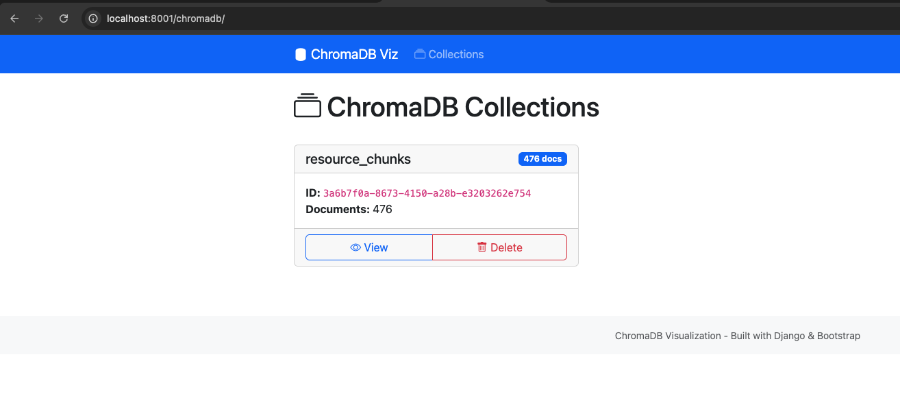
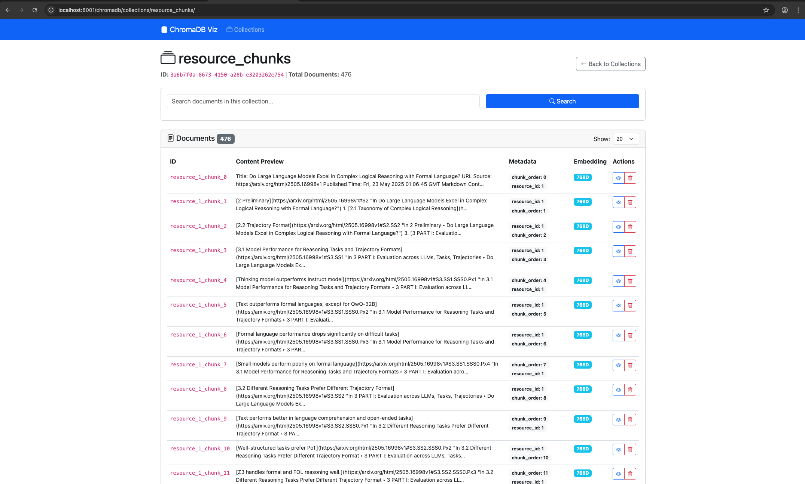
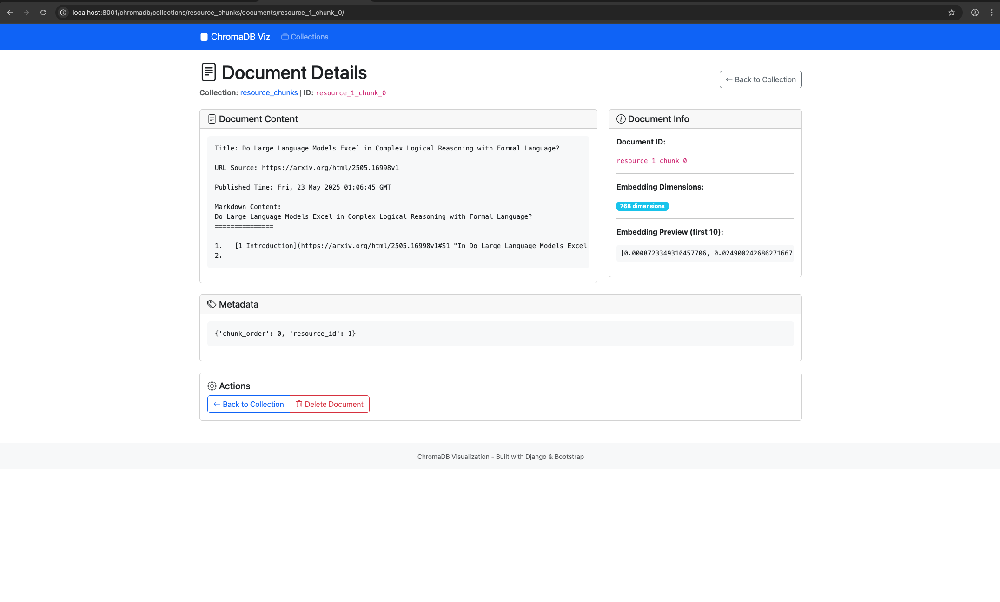
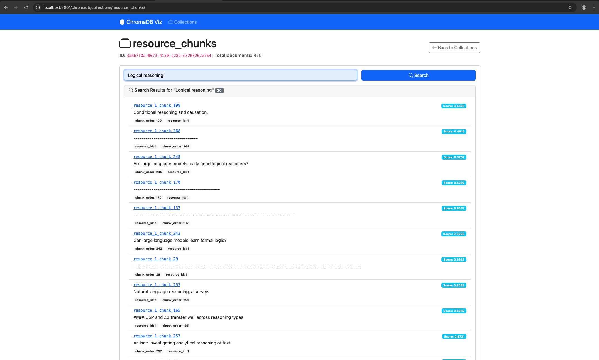

# Django ChromaDB Viz

A reusable Django app for visualizing and managing local ChromaDB instances. This application provides a web interface for browsing collections, viewing documents, and managing your vector database content.

## Features

- **Collection Management**: View all ChromaDB collections with metadata and document counts
- **Document Browsing**: Browse documents within collections
- **Document Details**: View detailed information about individual documents including content, metadata, and embedding information
- **Search**: Semantic search within collections using ChromaDB's vector search capabilities
- **Deletion Support**: delete collections and individual documents

## Screenshots

### Collections Overview



### Document Browser



### Document Details



### Search Capabilities



## Requirements

- Python 3.8+
- Django 4.0+
- ChromaDB 0.4.0+
- Loguru 0.7.0+

## Installation

### From PyPI (when published)

```bash
pip install https://github.com/sadeh-congnition/django-chromadb-viz.git
```

## Configuration

### 1. Add to Django Settings

Add `'django_chromadb_viz'` to your `INSTALLED_APPS`:

```python
INSTALLED_APPS = [
    # ... other apps
    'django_chromadb_viz',
]
```

### 2. Include URLs

Include the app's URLs in your project's `urls.py`:

```python
from django.urls import path, include

urlpatterns = [
    # ... other paths
    path('chromadb/', include('django_chromadb_viz.urls')),
]
```

### 3. Configure ChromaDB Connection

Add ChromaDB configuration to your `settings.py`:

```python
# ChromaDB settings
CHROMADB_PATH = '/path/to/your/chromadb'  # Default: ~/.chroma/default

# Embedding Settings: https://docs.trychroma.com/docs/embeddings/embedding-functions#custom-embedding-functions
CHROMADB_VIZ_EMBEDDING_FUNCTION = 'myapp.embeddings.get_embeddings'  # Path to custom embedding function
```

#### Custom Embedding Function

You can configure a custom embedding function by setting `CHROMADB_VIZ_EMBEDDING_FUNCTION` to the path of your embedding function. The function should accept a list of text strings and return a list of embedding vectors.

Example custom embedding function:

```python
# myapp/embeddings.py
import numpy as np
from sentence_transformers import SentenceTransformer

def get_embeddings(texts):
    """Generate embeddings for a list of texts."""
    model = SentenceTransformer('all-MiniLM-L6-v2')
    embeddings = model.encode(texts)
    return embeddings.tolist()
```

Then configure it in your `settings.py`:

```python
CHROMADB_VIZ_EMBEDDING_FUNCTION = 'myapp.embeddings.get_embeddings'
```

If no custom embedding function is configured, the system will fall back to ChromaDB's default embedding function.

### 4. Start the Development Server

```bash
python manage.py runserver
```

Visit `http://localhost:8000/chromadb/` to access the ChromaDB visualization interface.

## License

This project is licensed under the MIT License - see the [LICENSE](LICENSE) file for details.
